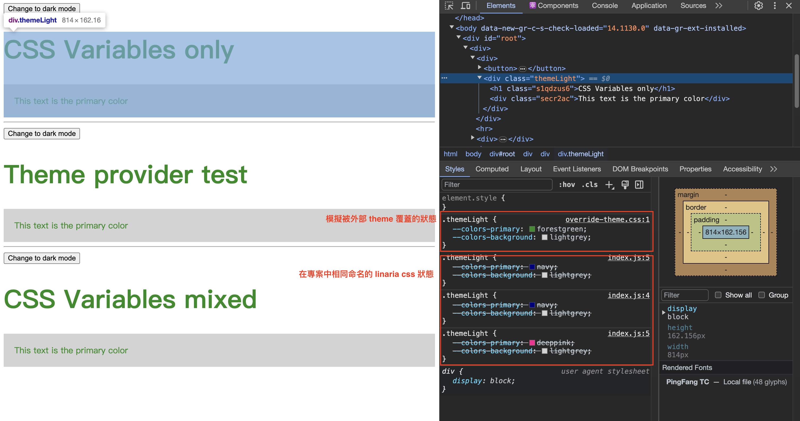

# Linaria So Fun
Linaria 是一個 Zero Run Time 的 CSS in JS 解決方案


## 資料夾介紹
- dist 是透過 webpack build 出來的結果，打開 index.html 就可以看到這個簡易的 app

- src 是這個 app 的主邏輯所在

請不要太計較 app 內容又簡陋又醜。


## 簡易解析
比對 dist 以及 src 檔案，可以得出以下：

### 非動態的 CSS 會由 linaria 生成 classname，並且將樣式產出進去 css。
觀察 App.js 中的 Section / Title Component 的 css，會發現相應的 div / h1 被綁上 class，並且可以在 dist/style.css 中找到相對應的 style 定義。

擷取 App.js 的宣告長這樣：
```javascript=

const Section = styled.div`
  border: 1px solid black;
`;

const Title = styled.h1`
  font-family: sans-serif;
  font-size: 48px;
  color: #f15f79;
`;

const App = () =>
  <Section>
    <Title>Hello world!</Title>
  </Section>
```

在 dist 中 css 會長這樣：
```css=
<!-- sm0as6w 對應 Section -->
.sm0as6w { 
  border: 1px solid black;
}

<!-- t13mnax5 對應 Title -->
.t13mnax5 {
  font-family: sans-serif;
  font-size: 48px;
  color: #f15f79;
}
```
React render 的  HTML 則是長這樣：
```html=
<div class="sm0as6w">
 <h1 class="t13mnax5"></h1>
</div>
```

### 利用 Props 傳入的動態 CSS (如 App.js 的 props.recSize)，則是會利用 css variable 來實踐。

linaria 會在 css 產出吃 css variable 的樣式定義，可在 dist/style.css 見到如下：
```css=
.bbb0x40 {
  background-color: orange;
  height: var(--bbb0x40-0);
  width: var(--bbb0x40-0);
}
``` 
可以看到 height 跟 width 都會吃 --bbb0x40-0。

但是這樣要怎麼讓寬高是動態的？
主要就是透過 React 的 style prop 在元件上面宣告 css variable。

如果透過瀏覽器打開 dist/index.html，可以看到 Box 對應的 html node如下：
```javascript=
<div class="bbb0x40" style="--bbb0x40-0: 133px;">133</div>
```
利用點擊 button，可以發現 style 中的 --bbb0x40-0 對應的值 (133px) 不斷地在增加。
linaria 內部實際上透過 style props 傳入 { '--bbb0x40-0': recSize }，因而達到動態改變樣式的效果。 

## 實作 Theme 調查：利用 css variable 實作 theming

### 1. 設定 webpack

1. .babelrc 加入 `"@linaria"`
2. loader 部分需要改為 `@linaria/webpack-loader`
3. 加入 classNameSlug 避免 theming 用的 class name 被 hashing

加入後可以看到原本在開發時用的命名 `.themeLight` 與 `.themeDark` 可以被保留，剩餘 pages/components 的 style 仍可保留 hash：

```css
.themeLight{--colors-primary:deeppink;--colors-background:lightgrey;}
.themeDark{--colors-primary:lightpink;--colors-background:black;}
.t183ux9g{font-family:sans-serif;font-size:48px;color:var(--colors-primary);}
.podgs4h{padding:20px;color:var(--colors-primary);background-color:var(--colors-background);}

.themeLight{--colors-primary:navy;--colors-background:lightgrey;}
.themeDark{--colors-primary:lightskyblue;--colors-background:black;}
.s1qdzus6{font-family:sans-serif;font-size:48px;color:var(--colors-primary);}
.secr2ac{padding:20px;color:var(--colors-primary);background-color:var(--colors-background);}
```

#### 注意事項

假如引入的元件中有重複的 theming classname，對於 linaria 都是獨立的 class，並不會組合成同一個 class 中，而是會分別打包；假如有相同的屬性，會根據引入順序由後面蓋掉前面。這邊使用了 `assets/

### 2. 使用外部 theme.css 覆蓋

這邊使用了 `public/override-theme.css` 模擬引入外部自訂 theme 的效果。

**可以在 public/index.html 中註解 `/override-theme.css` 看差異**

